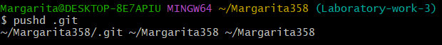

## Проста обробка текстових даних засобами оболонки Unix-подібних ОС інтерпретатора команд ОС

 
Рис. 1: Фрагмент екрану з рішенням завдання 2.1.1.1: Безпечне клонування GitHub-репозиторію.

 
Рис. 2: Фрагмент екрану з рішенням завдання 2.1.1.2: Перехід до каталогу із Git-репозиторієм.

 
Рис. 3: Фрагмент екрану з рішенням завдання 2.1.1.3: Створення та перехід на гілку «Laboratory-work-3».

 
Рис. 4: Фрагмент екрану з рішенням завдання 2.1.1.4: Створення каталогу «Laboratory-work-3» та перехід у нього.

 
Рис. 5: Фрагмент екрану з рішенням завдання 2.1.1.5: Створення порожнього файлу README.md.

 
Рис. 6: Фрагмент екрану з рішенням завдання 2.1.1.6: Додавання теми лабораторної роботи до README.md з Markdown форматуванням.

 
Рис. 7: Фрагмент екрану з рішенням завдання 2.1.1.7: Оновлення GitHub-репозиторію (git add, commit, push).

 
Рис. 8: Фрагмент екрану з рішенням завдання 2.1.1.8: Перехід на гілку «Laboratory-work-3» на GitHub та редагування README.md.

### 1 Навігація по файловій системі через засоби оболонки Git Bash інтерпретатору командного рядку Bash    

 
Рис. 9: Отримання переліку файлів поточного каталогу з урахуванням прихованих (ls -la). 

 
Рис. 10: Перехід до прихованого каталогу .git за допомогою pushd .git. 

 
Рис. 11: Перегляд вмісту файлу config через редактор nano. 

 
Рис. 12: Перелік файлів у псевдо табличному вигляді, відсортований за розміром у спадному порядку (ls -lhS). 

 
Рис. 13: Повернення до попереднього каталогу за допомогою popd.
